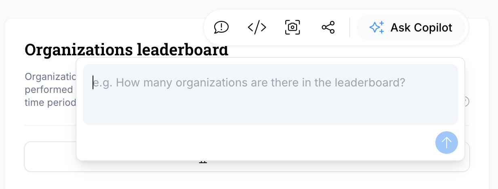
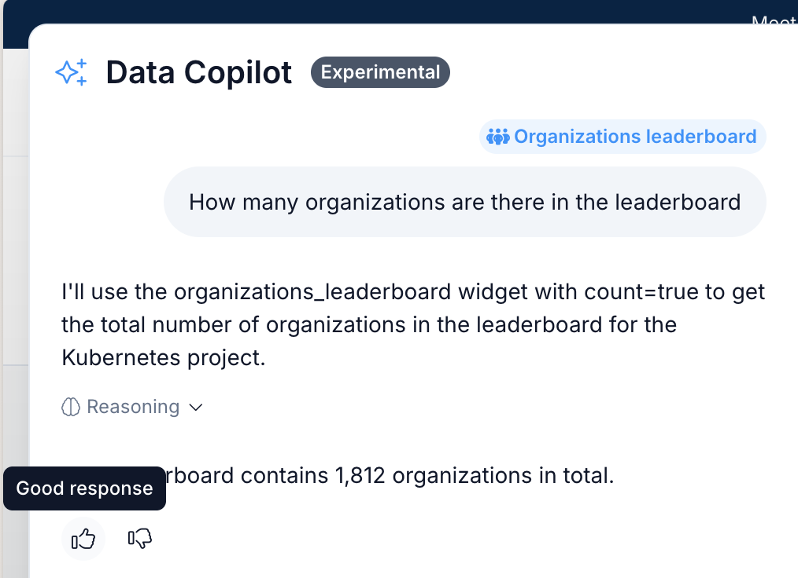

# LFX Data Copilot (Experimental)

::: warning ⚠️ Experimental Feature
LFX Data Copilot is currently in experimental phase and is only accessible to a limited number of users. Features and functionality may change as we continue to develop and refine this tool.
:::

## Overview

LFX Data Copilot is an AI-powered assistant designed to help you explore and understand project data within LFX Insights. Think of it as your personal data analyst that can answer questions about contributor activity, development trends, and popularity metrics using natural language.

The Data Copilot leverages data from LFX Insights to provide intelligent, contextual responses about open source projects. Whether you're looking to understand contributor patterns, development activity trends, or popularity metrics, the Data Copilot can help you uncover insights quickly and efficiently.

#### Key capabilities

- **Natural language queries** - Ask questions in plain English about contributor, development, and popularity data.
- **Data visualization** - View insights as charts or data tables. Get deeper insights and alternative perspectives on existing data that aren't visible in the standard Insights interface.
- **Trend identification** - Discover patterns and changes over time in project metrics.
- **Privacy-focused** - No access to personally identifiable information (PII).
- **Export data from table to CSV** - Download data for further analysis in your preferred tools.
- **View charts on demand** - Generate visual representations of data based on your specific queries.
- **Ask questions widget specific or project global** - Query data at both individual widget level and entire project scope.
- **User centered by allowing for feedback** - Continuous improvement through built-in feedback mechanisms on every response.

## How to use Data Copilot

### Accessing the Data Copilot

1. **Log in** with your LFID on [https://insights.linuxfoundation.org](https://insights.linuxfoundation.org).
2. **Navigate** to a project page of your choice.
3. **Click "Ask Copilot"** in the top right corner of the project page or on the action buttons of each widget.

*Button on top of each widget (excluding Contributors leaderboard and Contributors dependency)*

*Button on top of the project's page*

### Getting Started

1. **Start with a simple question** like "How has contributor activity changed over the last year?".
2. **Use natural language** - you don't need to use specific technical terms or query syntax
3. **Be specific** when possible - mention timeframes, specific metrics, or comparisons you're interested in
4. **Choose your view** - Data can be displayed as charts or tables, with table data being exportable

### Tips for Better Results

- **Be specific about timeframes** (e.g., "in the last 6 months", "since 2023")
- **Mention specific metrics** if you know them (e.g., "contributor count", "pull request metrics")
- **Use comparative language** when comparing projects or timeframes

## Feedback

Your feedback is crucial for improving the LFX Data Copilot. Since this is an experimental feature, we're actively collecting user input to enhance functionality and user experience.

### How to Provide Feedback In-App

- Use the feedback buttons below each one of the answers provided by the Data Copilot.

## Limitations

As an experimental feature, LFX Data Copilot has several current limitations:

### Data Scope
- **Limited to specific metrics** - Currently supports contributor, development, and popularity metrics only.
- **No PII access** - Cannot access personally identifiable information, making Contributor Leaderboard and Contributors Dependency widgets unavailable.

### Visualization & Export
- **Chart limitations** - Chart visualization is in early development and quite limited.
- **Data export** - Available for table data but not for charts.
- **Custom metric calculations** - Cannot create new metrics or calculations beyond existing data.

### Technical Limitations
- **Response time** - Complex queries may take longer to process.
- **Query complexity** - Very complex or ambiguous questions may not be interpreted correctly.

---

We're excited to have you try the LFX Data Copilot and help us shape its future development. Your experience and feedback during this experimental phase will directly influence how we evolve this feature to better serve the open source community.