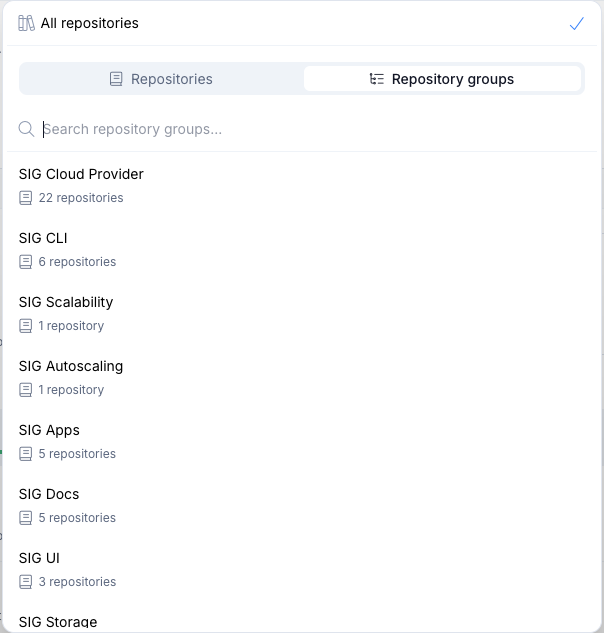

# Repository Groups

## Overview

Repository Groups are a way to organize and analyze multiple repositories together as a single unit within LFX Insights. Instead of viewing metrics for individual repositories in isolation, Repository Groups allow project maintainers and contributors to get a holistic view of an entire project ecosystem, even when that ecosystem spans multiple repositories.

This is especially useful for large open source projects that split their codebase across several repositories (e.g., a core library, CLI tooling, documentation, and plugins each living in separate repos).

## Example

The image below shows an example of the Repository Groups feature in the [Kubernetes](https://insights.linuxfoundation.org/project/k8s?timeRange=past365days&start=2025-03-03&end=2026-03-03) project.

## Requesting a Repository Group

Repository Groups are configured by the Insights team. If you'd like a Repository Group set up for your project, you can reach out through Insights public repository.

### Submit a GitHub issue

Open an issue on the [LFX Insights GitHub repository](https://github.com/linuxfoundation/insights/issues) and include the following information:

- **Project name** — The name of your project as it appears (or should appear) in Insights.
- **Repositories** — A list of the repository groups you'd like included in the project. For each repository group include the repository group name and the list of associated repository URLs.