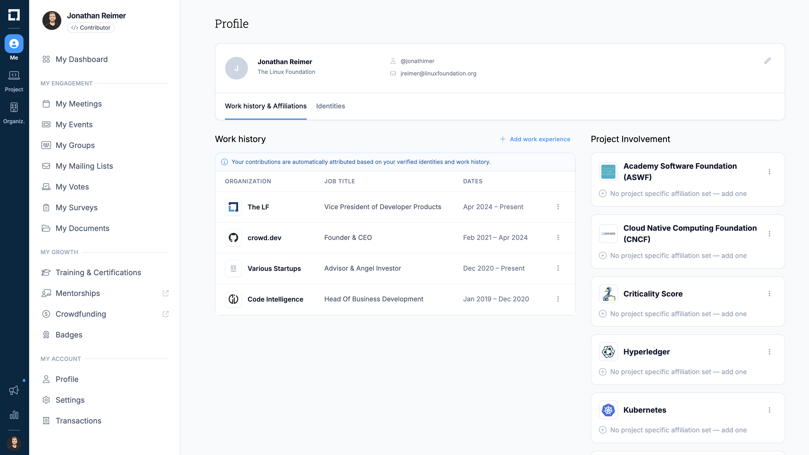

# Contributor Affiliations

Contributor affiliations map individual contributors to the organizations they represent. This is one of the most important data points in LFX Insights — it powers the Organizations Leaderboard, Organization Dependency metrics, and helps answer the question: *which companies are investing in this project?*

Getting affiliations right is hard. Contributors change jobs, use personal email addresses, and contribute across multiple organizations. GitHub profile data alone is often incomplete or outdated. LFX Insights uses a multi-signal enrichment process to build the most accurate picture possible.

## How We Determine Affiliations

We combine signals from multiple sources, each with different levels of confidence. These signals feed into a waterfall enrichment process where higher-confidence sources take precedence.

### Public Observable Signals

These are signals we can observe from publicly available data:

- **Git commit emails** — The email address in a commit's author field often contains an organizational domain (e.g., `jane@company.com`). This is one of the most common affiliation signals.
- **GitHub profile** — A contributor's GitHub profile may list their employer, organization memberships, or a company-affiliated email address.
- **Social profiles** — LinkedIn and other linked profiles can indicate current employment.
- **Email domains** — We maintain a mapping of known organizational email domains to their parent companies, including subsidiaries and acquisitions.

### LF-Internal Signals

For contributors who have a Linux Foundation ID (LF ID), we can access additional high-confidence data:

- **LF ID profile** — Contributors may have employer information stored in their LF ID account.
- **LF membership records** — Organizational membership data from the Linux Foundation's records.

These internal signals are typically more reliable than public signals because they are self-reported and verified through the LF's membership processes.

## Waterfall Enrichment Process

Affiliation data goes through a waterfall enrichment pipeline. Signals are evaluated in priority order — when a higher-confidence source provides an affiliation, it takes precedence over lower-confidence sources.

For example, a contributor's self-reported employer in their LF ID profile would take priority over an inferred affiliation from a commit email domain. This layered approach ensures that the most reliable data wins while still filling gaps with lower-confidence signals when no better source is available.

The enrichment process runs continuously as new data is ingested, so affiliations are updated as contributors change roles or new signals become available.

## Data Cleaning & Deduplication

Contributors often appear under multiple identities — different email addresses, usernames, or social accounts. Our platform runs several services to clean and deduplicate this data:

- **Identity matching** — We merge multiple identities that belong to the same person into a single contributor profile.
- **Organization normalization** — We resolve different names for the same organization (e.g., "Google LLC", "Google Inc.", "Alphabet") into a canonical entity.
- **Historical tracking** — We maintain affiliation history so that past contributions are attributed to the correct organization at the time they were made.

For more details on how we handle data quality across the platform, see [Data Quality](/docs/introduction/data-quality/index.md).

## Review & Edit Your Affiliations

We know automated enrichment isn't perfect. That's why contributors can review and edit the affiliation data we have stored about them directly in LFX.

To review your affiliations:

1. **Log in** to your [LF ID](https://myprofile.lfx.linuxfoundation.org/) account
2. **Navigate** to your profile and select the "Work History & Affiliations" tab
3. **Review** your current and historical organization affiliations
4. **Edit** any incorrect affiliations — for example, updating your current employer or correcting a past affiliation date range

*New profile view in LFX: Your work history and project involvements determine your affiliations in Insights.*

> [!NOTE]
> This self-service affiliation editing feature is currently in beta and rolling out to all users in the coming weeks. If you spot an incorrect affiliation in the meantime, you can report it using the "Report issue" button on any data point in Insights, or contact us at [insights@linuxfoundation.org](mailto:insights@linuxfoundation.org).
