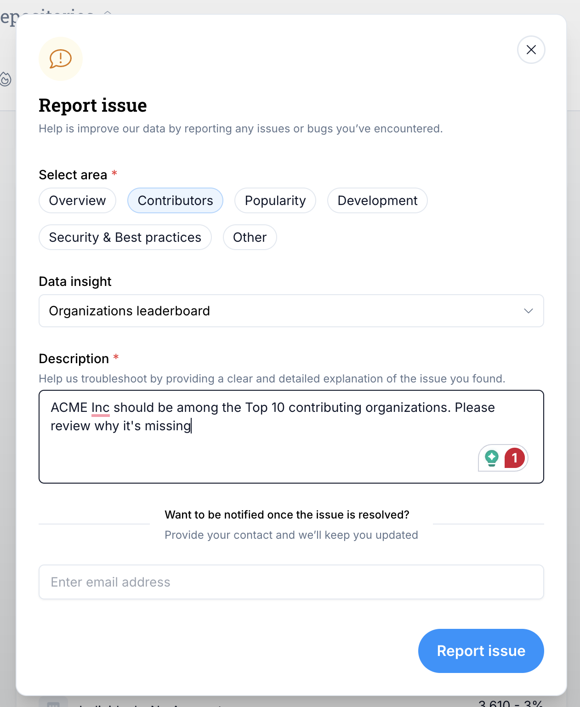

# Data Quality
The data in LFX Insights is powered by Linux Foundation's [Community Data Platform (CDP)](https://github.com/CrowdDotDev/crowd.dev). CDP aggregates, cleans, enriches, and analyzes information across thousands of open source projects. 

As anyone who's worked with open source data knows, the data can be messy. In the following we describe some of the data challenges as well as the data quality process that runs in the background.

## Why Open Source Data Is Complex
Open source contributions span diverse communities, tools, and structures. There’s no single source of truth - which creates challenges in mapping and cleaning data.

Here are some examples of the challenges we face:

**Contributors**
- Use different email addresses and social handles across platforms
- Frequently change employers
- Add personal or hobby projects to their open-source profiles

**Organizations**
- Have complex corporate structures with nested subsidiaries
- Rename, merge, or restructure
- Use different domains and naming conventions across platforms

**Projects**
- Use different platforms & tools (GitHub, GitLab, mailing lists, etc.)
- Lack consistent governance metadata (e.g., unclear maintainer roles)
- Sometimes represent mirrors, experiments, or documentation-only repos

## Our Data Quality Process
To ensure data completeness and correctness, we follow a multi-step process that combines automation, human validation, and community feedback.

### Step 1: Raw Data Collection
We collect raw data from third-party sources like GitHub via our Community Data Platform. At this stage, data correctness is sometimes as low as 20% due to duplication, mismatches, or outdated information.

### Step 2: Data Onboarding
We ingest data into LFX systems and structure it for analysis. This includes linking identities, mapping contributors to organizations, and parsing contribution records.

### Step 3: AI-Powered Enrichment & Deduplication
Our internal AI agents clean, enrich, and deduplicate the data. At this stage, we achieve ~90% data correctness.

### Step 4: Manual QA & Feedback Loops
Our data quality team manually reviews edge cases and uses:

- Random sample checks across projects
- Feedback from project maintainers & LF staff
- Self-correction mechanisms from within Insights (see "How you can help to improve data quality")

At this point, data correctness is typically above 90%, continuously improving with user feedback.

## How You Can Help to Improve Data Quality
We know that the data is not perfect (and probably never will be). There are too many moving parts in open source and too many weak control data sources. We therefore rely on the community to help us correct incorrect data. 

1. **Click "Report issue"** on any data point in Insights

2. **Fill out the form** and click "Submit"

3. **We'll review the issue** and get back to you (if you left us an email address)

You can also contact us directly at [insights@linuxfoundation.org](mailto:insights@linuxfoundation.org).