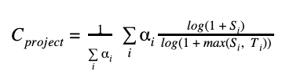

# LF Open Source Index

How we define which projects are included in Insights.

## What is the LF Open Source Index?
The LF Open Source Index is a curated view of the most critical open source projects powering our modern digital infrastructure. It defines the scope of projects shown in LFX Insights, helping developers, maintainers, and organizations understand what’s truly foundational to the open source ecosystem.

## Which projects are included
At its core, the LF Open Source Index (and therefore Insights) includes:

- **All Linux Foundation-hosted projects**, across all Linux Foundation (LF) initiatives and foundations - see [here](https://www.linuxfoundation.org/projects/).
- **Critical non-LF projects** that are widely adopted and essential to a global developer audience.

We aim to cover projects that are not just active, but impactful and deeply integrated into the technology stack of the modern world.

## How we define "critical" projects

To identify critical open source projects outside of the LF, we rely on the [OpenSSF Criticality Score](https://github.com/ossf/criticality_score) — an open-source metric that evaluates projects based on:

- GitHub activity and contributor base
- Project dependencies
- Popularity indicators (e.g., stars, forks)
- Community responsiveness and velocity

In the future, **we aim to cover the Top 10,000 projects by Criticality Score**. This roll-out will take place gradually.
### Criticality Score 
The **Criticality Score** is a metric presented in LFX Insights for the selected open source projects to indicate their relative importance and impact on the broader open source ecosystem.

The **Criticality Score** quantifies how essential an open source project is by evaluating multiple dimensions of its usage, popularity, community engagement, and activity. It is displayed on the project overview page as a numeric indicator, but only for projects where relevant data is available.

In the future, **we aim to cover the Top 10,000 projects by Criticality Score**. This roll-out will take place gradually.

#### How is the Critical Score Calculated?
The **Criticality Score** is a number between 0 (least-critical) and 1 (most-critical). It is for a project is calculated using the following formula:


```
C_project = (1 / sum(alpha_i)) * sum(alpha_i * (log(1 + S_i) / log(1 + max(S_i, T_i))))
```

**Where:**
- `C_project` is the final criticality score.
- `alpha_i` (α) is the weight of a given parameter.
- `S_i` is the value of a given parameter for the project.
- `T_i` is the maximum threshold for a given parameter.

The critical score is calculated by averaging the logarithmically normalized scores of various factors. Log normalization reduces the impact of very high or low values, while thresholding limits how much any single factor can affect the score.

#### Parameters

The following table details the parameters used in the calculation, along with their weights, thresholds, and the reasoning behind their inclusion.

| Parameter (S<sub>i</sub>)  | Weight (&alpha;<sub>i</sub>) | Max threshold (T<sub>i</sub>) | Description | Reasoning |
|---|---:|---:|---|---|
| created_since | 1 | 120 | Time since the project was created (in months) | Older project has higher chance of being widely used or being dependent upon. |
| updated_since  | -1 | 120 | Time since the project was last updated (in months) | Unmaintained projects with no recent commits have higher chance of being less relied upon. |
| **contributor_count** | **2** | 5000 | Count of project contributors (with commits) | Different contributors involvement indicates project's importance. |
| org_count | 1 | 10 | Count of distinct organizations that contributors belong to | Indicates cross-organization dependency. |
| commit_frequency | 1 | 1000 | Average number of commits per week in the last year | Higher code churn has slight indication of project's importance. Also, higher susceptibility to vulnerabilities.
| recent_releases_count | 0.5 | 26 | Number of releases in the last year | Frequent releases indicates user dependency. Lower weight since this is not always used. |
| closed_issues_count | 0.5 | 5000 | Number of issues closed in the last 90 days | Indicates high contributor involvement and focus on closing user issues. Lower weight since it is dependent on project contributors. |
| updated_issues_count | 0.5 | 5000 | Number of issues updated in the last 90 days | Indicates high contributor involvement. Lower weight since it is dependent on project contributors. |
| comment_frequency | 1 | 15 | Average number of comments per issue in the last 90 days | Indicates high user activity and dependence. |
| **dependents_count** | **2** | 500000 | Number of project mentions in the commit messages | Indicates repository use, usually in version rolls. This parameter works across all languages, including C/C++ that don't have package dependency graphs (though hack-ish). Plan to add package dependency trees in the near future. |

#### Example Calculation: `Sample Project`

Let's use the provided example of a `Sample project` to illustrate how the score is calculated.

**Input Values:**
```
- `created_since`: 90
- `updated_since`: 0
- `contributor_count`: 4000
- `org_count`: 5
- `commit_frequency`: 97.5
- `recent_releases_count`: 70
- `updated_issues_count`: 5395
- `closed_issues_count`: 3062
- `comment_frequency`: 4.5
- `dependents_count`: 39830
```
***

**Calculation Steps:**


>1. **Calculate the score for each parameter:**
   For each parameter, we calculate `alpha_i * (log(1 + S_i) / log(1 + max(S_i, T_i)))`.
>

>2. **Sum the weighted scores:**
   `0.940 + 0 + 1.947 + 0.747 + 0.664 + 0.5 + 0.5 + 0.471 + 0.615 + 1.614 = 7.998`

>3. **Sum the weights:**
   `1 + (-1) + 2 + 1 + 1 + 0.5 + 0.5 + 0.5 + 1 + 2 = 9.5`

>4. **Calculate the final score:**
   `7.998 / 9.5 = 0.841`

This detailed process, when applied to all the parameters for the `Sample project`, results in a final criticality score of approximately **0.841**.

#### Availability

The Criticality Score is **not available for every project** in LFX Insights. It is only shown for repositories where sufficient data exists to run the scoring model reliably.

#### Why Project Criticality Matters

Identifying a project as “critical” helps:

- Prioritize resource allocation for security reviews and maintenance
- Guide funding and community support to essential infrastructure
- Highlight risks associated with unmaintained or under-resourced dependencies

By surfacing this information, LFX Insights aims to help stakeholders make more informed decisions about which projects require additional attention or support.

#### Learn More

To explore the model, source code, and most up-to-date methodology, visit the [OpenSSF Criticality Score](https://github.com/ossf/criticality_score).
### Manual curation

While the index is data-driven, we apply a layer of manual curation to maintain quality and relevance:

- We exclude projects that are pure documentation or mirrors (e.g., kernel mirrors).
- We aim to avoid duplication, noise, or “ghost repositories”.

Our goal is not quantity, but clarity - showcasing the projects that companies and developers rely on.

## Evolving scope

The LF Open Source Index is not static. As the ecosystem evolves, we continuously review and consider:

- New LF projects
- Emerging non-LF projects
- Projects that have become deprecated or inactive

If you have any questions or feedback, please reach out to us at [insights@linuxfoundation.org](mailto:insights@linuxfoundation.org). We are open to improving the selection process together with the community.
