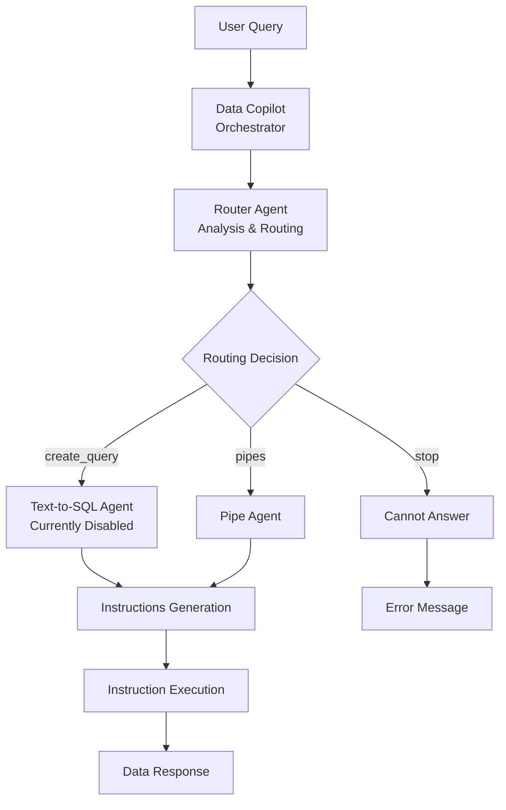
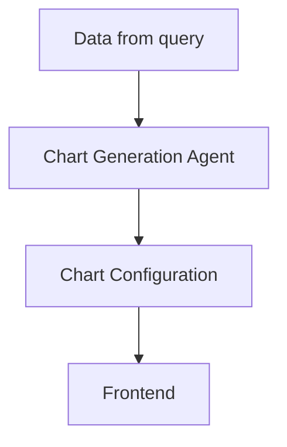

# Insights Copilot - Multi-Agent Architecture Documentation

## To Do

### Joan

- [x] Handle better queries like "What is love?"
- [x] Remove textToSql from the router for now.

### Team

#### v0

- [ ] Improve Graph Generation
  - [ ] From Nuno: we will need to generate a title when we generate a graph
  - [ ] Make sure it's reliable

#### Later

- [ ] Split the chat into 3 endpoints:
  - One to do the agentic stuff and return instructions
  - One to execute the instructions and return data
  - One to generate the chart (already done)
- [ ] Re-enable Text-to-SQL Agent when ready

## Overview

The Insights Chat system implements a sophisticated multi-agent architecture that processes user queries through specialized agents, each responsible for different aspects of question analysis and data retrieval. The system follows an **instruction-based architecture** where agents generate execution plans (instructions) that are then executed separately, providing clear separation between planning and execution phases.

## Architecture

### Core Flow





### Orchestration Layer

The entire system is orchestrated through **`frontend/lib/chat/data-copilot.ts`**, which:

1. **MCP Client Setup**: Creates a Model Context Protocol client for Tinybird integration
2. **Tool Discovery**: Dynamically retrieves all available tools from Tinybird
3. **Router Execution**: Runs the Router Agent to analyze user intent
4. **Agent Selection**: Based on routing decision, executes the appropriate specialized agent
5. **Instruction Execution**: Executes generated instructions to fetch data
6. **Response Streaming**: Streams results back to client using `createDataStreamResponse`

### Multi-Agent System

#### 1. Router Agent (`frontend/lib/chat/agents/router.ts`)

**Purpose**: First-line analysis that determines how to answer user questions

**Key Features**:

- Temperature: 0 (deterministic)
- Max Steps: 3
- Available Tool: `list_datasources` only (can see all tools but only execute this one)

**Decision Process**:

1. Check if existing pipe tools can answer the question
2. If not, examine data sources to see if custom query is possible
3. Return routing decision with tool selection

**Output Schema**:

```typescript
{
  next_action: "stop" | "create_query" | "pipes",
  reasoning: string,           // User-friendly explanation
  reformulated_question: string, // Enhanced query with context
  tools: string[]              // Tools for next agent to use
}
```

**Prompt**: [`frontend/lib/chat/prompts/router.ts`](frontend/lib/chat/prompts/router.ts)

#### 2. Text-to-SQL Agent (`frontend/lib/chat/agents/text-to-sql.ts`) - Currently Disabled

**Purpose**: Generates custom SQL queries for complex questions

**Key Features**:

- Temperature: 0 (deterministic)
- Max Steps: 10
- Reasoning Budget: 3000 tokens (via Bedrock configuration)
- Tools: `list_datasources`, `execute_query`

**Output Schema**:

```typescript
{
  explanation: string,     // Why this query answers the question
  instructions: string     // The SQL query to execute
}
```

**Current Status**: Temporarily disabled (commit 31392b7). Router returns a message explaining that custom queries will be available soon.

**Prompt**: [`frontend/lib/chat/prompts/text-to-sql.ts`](frontend/lib/chat/prompts/text-to-sql.ts) - Comprehensive 213-line prompt with:

- ClickHouse SQL reference
- Query enhancement rules
- Time-based logic defaults
- Validation methodology

#### 3. Pipe Agent (`frontend/lib/chat/agents/pipe.ts`)

**Purpose**: Executes pre-built Tinybird pipes and combines their outputs

**Key Features**:

- Temperature: 0 (deterministic)
- Max Steps: 10
- Tools: Dynamic (filtered by router's tool selection)

**Output Schema**:

```typescript
{
  explanation: string,
  instructions: {
    pipes: [
      {
        id: string,          // Unique identifier
        name: string,        // Actual pipe name
        inputs: object       // Parameters
      }
    ],
    output: [
      // Direct column mapping
      {
        type: "direct",
        name: string,
        pipeId: string,
        sourceColumn: string
      },
      // Formula columns for calculations
      {
        type: "formula",
        name: string,
        formula: string,     // JavaScript expression
        dependencies: [...]
      }
    ]
  }
}
```

**Prompt**: [`frontend/lib/chat/prompts/pipe.ts`](frontend/lib/chat/prompts/pipe.ts)

### Instruction Execution Layer

**File**: `frontend/lib/chat/instructions.ts`

The instruction execution layer provides functions to execute the instructions generated by agents:

#### `executePipeInstructions(instructions: PipeInstructions)`

1. Executes each pipe via Tinybird API (`executeTinybirdPipe`)
2. Collects results indexed by pipe ID
3. Combines results according to output instructions:
   - **Direct mapping**: Simple column-to-column transfer
   - **Formula evaluation**: Safe JavaScript expression evaluation with limited scope
4. Returns combined data array

#### `executeTextToSqlInstructions(query: TextToSqlInstructions)`

1. Executes SQL query via Tinybird's Query API
2. Handles authentication and formatting
3. Returns query results as data array

### Base Agent Framework

All agents extend `BaseAgent` class (`frontend/lib/chat/agents/base-agent.ts`):

**Provides**:

- Structured output validation using Zod schemas
- Automatic JSON formatting instructions
- Consistent error handling
- Tool management interface
- Temperature control
- Step limits

**Key Methods**:

- `getModel()`: Returns AI model instance
- `getSystemPrompt()`: Builds agent-specific prompt
- `getTools()`: Filters available tools
- `run()`: Executes agent with reasoning

## Tinybird Integration

### MCP (Model Context Protocol) Setup

```typescript
const mcpClient = await createMCPClient({
  transport: new StreamableHTTPClientTransport(url, {
    sessionId: `session_${Date.now()}`,
  }),
});
```

### Available Tool Types

1. **Data Source Tools**:
   - `list_datasources`: Lists tables and schemas
   - `execute_query`: Executes custom SQL (Text-to-SQL only)

2. **Pipe Tools**:
   - Dynamic tools based on Tinybird workspace
   - Each pipe becomes an executable tool
   - Parameters passed as inputs

## Key Architecture Benefits

### 1. Separation of Concerns

- **Router**: Analysis and routing logic only
- **Specialized Agents**: Domain-specific instruction generation
- **Execution Layer**: Pure execution without decision logic

### 2. Instruction-Based Architecture

- Agents generate plans, not execute them
- Clear audit trail of decisions
- Easier testing and debugging
- Potential for instruction optimization before execution

### 3. Tool Management

- Router sees all tools but can't execute them all
- Specialized agents receive filtered tool sets
- Clear tool access boundaries

### 4. Formula Support

- Complex calculations via formula columns
- Variable dependency tracking
- Safe JavaScript evaluation environment

### 5. Error Handling

- Graceful degradation at each layer
- Detailed error logging
- User-friendly error messages

# Model Configuration

Currently using: `anthropic.claude-opus-4-6-v1` via AWS Bedrock

## Data Flow Example

1. **User Query**: "What were the top users last month?"

2. **Router Agent**:

   ```json
   {
     "next_action": "pipes",
     "reasoning": "Can answer using top_users pipe",
     "reformulated_question": "Show top users for last month...",
     "tools": ["top_users"]
   }
   ```

3. **Pipe Agent Instructions**:

   ```json
   {
     "pipes": [
       {
         "id": "users",
         "name": "top_users",
         "inputs": { "start_date": "2024-11-01", "end_date": "2024-11-30" }
       }
     ],
     "output": [
       { "type": "direct", "name": "User", "pipeId": "users", "sourceColumn": "user_name" },
       { "type": "direct", "name": "Activity", "pipeId": "users", "sourceColumn": "event_count" }
     ]
   }
   ```

4. **Execution & Response**: Combined data table streamed to client
